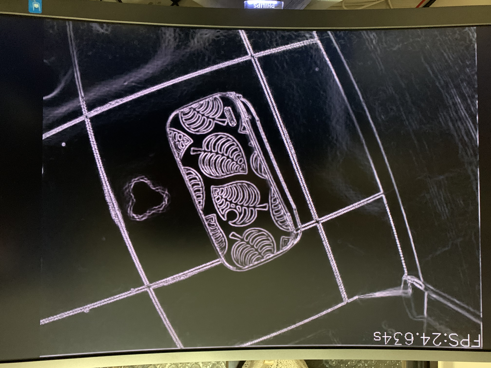
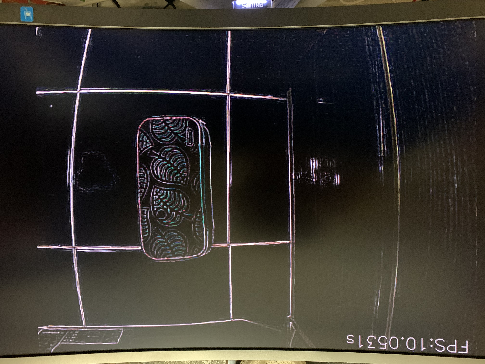

# PYNQ-Z2 accelerating sobel filter on USB to HDMI vidoer sreaming.
Building a sobel filter accelerator and filter the streaming video from USB camera to HDMI

Board: PYNQ-Z2
PYNQ version: V2.5

## Demo:
HW accel: ~24fps


OpenCV: ~10fps



## Quick Start:

1. Setup PYNQ-Z2 then connect USB camera and HDMI monitor for video output. For PYNQ-Z2 Setup guide, please reference to official documentation [here](https://pynq.readthedocs.io/en/v2.5.1/getting_started/pynq_z2_setup.html). 

2. Upload these three files to the PYNQ-Z2 board in same directory.
    * **base_w_sobel.bit**,
    * **base_w_sobel.hwh**,
    * **USB to HDMI Sobel video streaming.ipynb**  

3. Run ***USB to HDMI Sobel video streaming.ipynb*** on jupyter notebook from PYNQ-Z2. You can stop the program by pressing **BTN3** on the board or click **interupt the kernel** from jupyter notebook.

## Rebuild HW design
This design used base overlay from [PYNQ official github repository](https://github.com/Xilinx/PYNQ) and add in the custom sobel acceleration IP. I've genetate tcl scripts for building vivado project. 
For rebuilding HW design of this project, you need **Vivado 2020.1**.  

if you want to see the HLS source code for sobel accelerate, you can click [here](/HW_rebuild/ip/hls/sobel/) or find it under ***HW_rebuild/ip/HLS/sobel*** this directory.

#### Linux
Test environment:Ubuntu18.04
1. Set up the Vivado environment in terminal.
    ```
    source <vivado_install_path>/setup.sh
    ```
2. cd to directory ***HW_rebuild/Pynq-Z2/base_w_sobel*** under this repository. 

    ```
    cd <this_repo>/HW_rebuild/Pynq_Z2/base_w_sobel
    ```

3. Just use **make** command and it will run all tcl scripts.   
    ```
    make
    ```
4. After it's done, you will see **"Built base_w_sobel successfully!"** this message. Then you can find **base_w_sobel.bit** in ***HW_rebuild/Pynq-Z2/base_w_sobel/base_w_sobel/base_w_sobel.runs/impl_1/*** this directory, and **base_w_sobel.hwh** in ***HW_rebuild/Pynq-Z2/base_w_sobel/base_w_sobel/base_w_sobel.srcs/sources_1/bd/base_w_sobel/hw_handoff*** this directory.

If you just want to take a look at block design in vivado, you can use the command below, instead of running entire makefile.

```
make hls_ip block_design
```

Then you can find the vivado project under ***HW_rebuild/Pynq-Z2/base_w_sobel/base_w_sobel/***

#### Windows
For windows user, please use vivado cmd to run the commands below.
1. Build HLS IP
```
vivado -mode batch -source build_ip.tcl -notrace
```
2. Create Block Design 
```
vivado -mode batch -source base_w_sovel.tcl -notrace
```
3. Generate Bitstream
```
vivado -mode batch -source build_bitstream.tcl -notrace
```

4. Check Timing
```
vivado -mode batch -source check_timing.tcl -notrace
```

After running all commands, you can find **base_w_sobel.bit** in ***HW_rebuild/Pynq-Z2/base_w_sobel/base_w_sobel/base_w_sobel.runs/impl_1/*** this directory, and **base_w_sobel.hwh** in ***HW_rebuild/Pynq-Z2/base_w_sobel/base_w_sobel/base_w_sobel.srcs/sources_1/bd/base_w_sobel/hw_handoff*** this directory.

If you just want to take a look at block design in vivado, you can skip step 3,4 for time saving.  
Then you can find the vivado project under ***HW_rebuild/Pynq-Z2/base_w_sobel/base_w_sobel/***